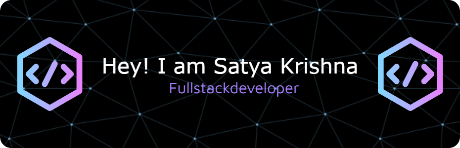

## 🚀 About Me

   

-  I'm currently working on **Chat with Repo**
-  I'm currently learning **LLMs, Vector Databases**
-  I'm looking to collaborate on **Open Source Projects**
-  I'm looking for help with **Full Stack Development and Design**
-  Ask me about **MERN Stack with LLMs**
-  How to reach me: **satyakrishna883@gmail.com**

 

## 📫 Let's Connect & Collaborate

  <table>
    <tr>
      <td align="center" width="200">
        <a href="https://www.linkedin.com/in/satyakrishna-gatti/" target="_blank">
          
           
          <b>LinkedIn</b>
        </a>
      </td>
      <td align="center" width="200">
        <a href="mailto:satyakrishna883@gmail.com" target="_blank">
          
           
          <b>Email</b>
        </a>
      </td>
      <td align="center" width="200">
        <a href="https://satya-portfolio-ashen.vercel.app/" target="_blank">
          
           
          <b>Portfolio</b>
        </a>
      </td>
    </tr>
  </table>

 

## 🛠️ Tech Stack

###  Programming Languages

  

###  Frontend Development

  

###  Backend Development

  

###  Databases

  

### 🔧 Tools & Others

  

 

## Leetcode Badges

---

## GitHub Stats

  

---

## 🌟 Featured Projects

  

 

  <h3>⭐ Don't forget to star my repositories if you find them useful! ⭐</h3>
  
<i>Made with ❤️ </i>

